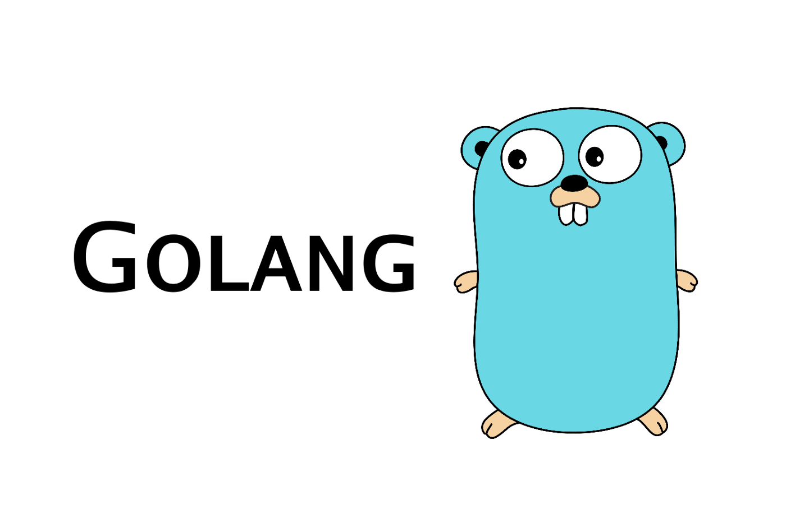

# Breaking Bad API 



## Contents
[Descriptions](#Descriptions)  

[Stage](#Stage)  

[Endpoints - Characters](#GET---GetCharacters) 

[Endpoints - Quotes](#GET---GetQuotes)

[Endpoints - Episodes](#GET---GetEpisodes)

[Endpoints - Deaths](#GET---GetDeaths)  

# 
##  Descriptions
 This is a REST API developed in golang to obtain information about the episodes, quotes of the characters and how they died and see the characters.
 The file **"CharacterBB.txt"** contains the data of all the characters to use them in the REST API.
 

 # 
 ## Stage
The project is carried out with a MVC structure (Model Views Controllers). The file **"CharacterBB.txt"**

**Router:** This a interfaces between endpoints and its corresponding controllers.

**Controllers:** This is the intermediary between the router and the services. It handles the rest messages.

**Services** This contains the business logic.

**Domain**: This contains the structs and interfaces to development of the API.


# 
## Endpoints
###Characters

#### GET-GetCharacters()
>localhost:8086/getcharacters

**Response Code** 200 Ok

**Response Body** 
```
]

    {   
        "char_id":1,
        "name":"Walter White",
        "birthday":"09-07-1958",
        "occupation":["High School Chemistry Teacher","Meth King Pin"],
        "img":"https://images.amcnetworks.com/amc.com/wp-content/uploads/2015/04/cast_bb_700x1000_walter-white-lg.jpg",
        "status":"Presumed dead",
        "nickname":"Heisenberg",
        "appearance":[1,2,3,4,5],
        "portrayed":"Bryan Cranston",
        "category":"Breaking Bad",
        "better_call_saul_appearance":[]
    },
         ...
]
```
#
#### GET-GetCharactersID()
>localhost:8086/getcharacters/:id

**Response Code** 200 Ok

**Response Body**


# 
#### POST-PostCharacters()
>localhost:8086/createcharacters

**Response Code** 200 Ok

**Response Body** 

#
#### PUT- PutCharacters()
>localhost:8086/updatecharacters

**Response Code** 200 Ok

**Response Body**

#
#### PUT- DeleteCharactersID()
>localhost:8086/deletecharacters/:id

**Response Code** 200 Ok

**Response Body**


#

###Quotes
#### GET-GetQuotes()
>localhost:8086/getquotes

**Response Code** 200 Ok

**Response Body** 


#
#### GET-GetQuotesID()
>localhost:8086/getquotes/:id

**Response Code** 200 Ok

**Response Body** 


#

###Episodes
#### GET-GetEpisodes()
>localhost:8086/getepisodes

**Response Code** 200 Ok

**Response Body** 


#
#### GET-GetEpisodesID()
>localhost:8086/getepisodes/:id

**Response Code** 200 Ok

**Response Body** 


#

###Deaths
#### GET-GetDeaths()
>localhost:8086/getdeaths

**Response Code** 200 Ok

**Response Body** 


